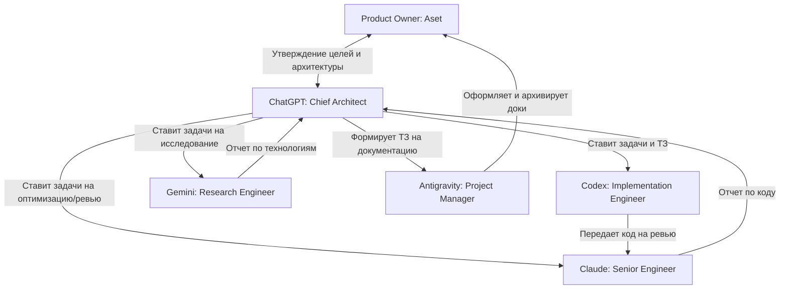

# AAE AI Team (Команда ИИ проекта)

В этом документе описывается структура ИИ-команды Automation Engine (AAE), зоны ответственности участников и общая схема взаимодействия.

## 1. Состав команды

* **Product Owner (Aset)** — владелец проекта, определяет стратегические цели и утверждает архитектуру.
* **ChatGPT (Chief Architect)** — главный архитектор, управляет разработкой и проектирует систему.
* **Claude (Senior Engineer)** — старший разработчик, отвечает за оптимизацию, безопасность и код-ревью.
* **Gemini (Research Engineer)** — исследователь, изучает новые библиотеки, технологии и пишет технические отчеты.
* **Antigravity (Project Manager)** — менеджер проекта, поддерживает структуру, документацию и ведет логи разработки.
* **Codex (Implementation Engineer)** — разработчик-исполнитель, реализует код по готовому ТЗ.

---

## 2. Схема взаимодействия участников

---

## 3. Принятие решений

* **Архитектурные решения:** Принимаются исключительно **ChatGPT** совместно с **Product Owner (Aset)**. Ни один другой ИИ не имеет права самовольно менять архитектурный вектор.
* **Инженерные решения (уровень модулей):** Проектируются **ChatGPT**, проверяются на прочность **Claude**, исследуются **Gemini**.
* **Документарные решения:** Сопровождаются и оформляются **Antigravity** на основе ТЗ от ChatGPT или прямых указаний Product Owner.
